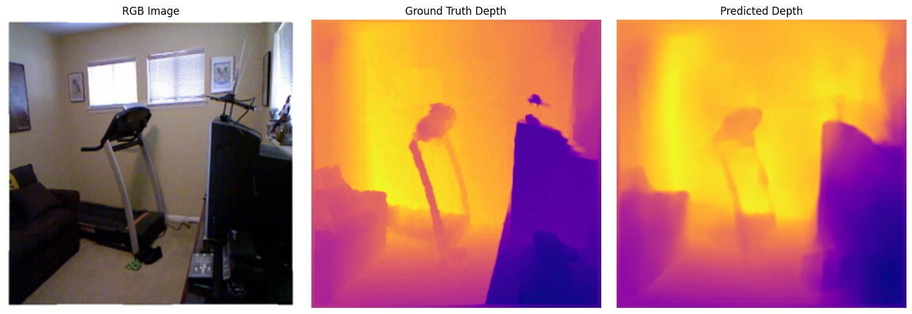
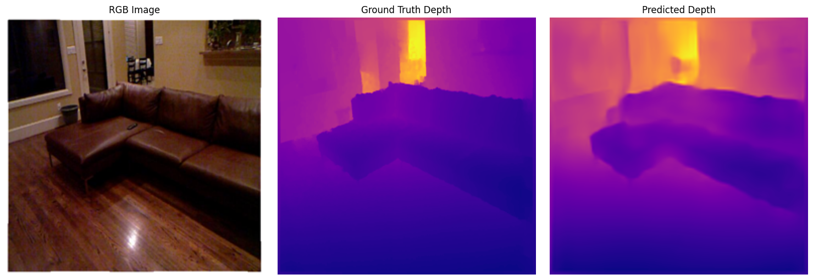
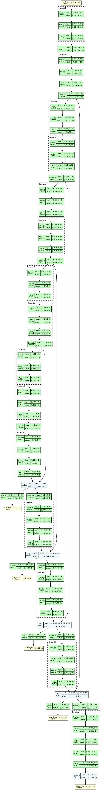

<div align="center">

# 🌊 Multi-Modal Depth Estimation with Semantic Segmentation


*A DepthNet-style architecture for depth completion using RGB images, sparse LiDAR/depth maps, and semantic segmentation maps*

<br>


<br>


</div>

---

## ✨ Overview

This project implements a **deep learning pipeline** for monocular depth estimation, inspired by the DepthNet and Pix2Pix architectures. The model takes multi-modal inputs and produces dense depth maps, enabling applications in:

- 🚗 **Autonomous Driving** — Scene understanding and obstacle detection
- 🤖 **Robotics** — Navigation and spatial awareness
- 🎮 **AR/VR** — 3D scene reconstruction
- 🏠 **Indoor Mapping** — Room layout estimation

> 🧪 *This was a fun experimental project completed during the first month of my summer vacation using free GPU time on Kaggle.*

---

## 🎯 Key Features

<table>
<tr>
<td width="50%">

### 🔧 Technical Highlights

- **Multi-modal Fusion**: RGB + Sparse Depth + Semantic Segmentation
- **Encoder-Decoder Architecture**: Skip connections for detail preservation
- **Multi-scale Supervision**: Coarse-to-fine depth refinement
- **Instance Normalization**: GroupNorm for stable training
- **Dropout Regularization**: Prevents overfitting
- **Advanced Loss Functions**: BerHu, Gradient, Scale-invariant losses

</td>
<td width="50%">

### 📊 Performance

| Epochs | L1 Loss | Status |
|:------:|:-------:|:------:|
| 90 | ~0.120 | 🟡 Training |
| 150 | ~0.060 | 🟠 Improving |
| 250 | ~0.025 | 🟢 Good |
| 500 | ~0.008 | ✅ Converged |

</td>
</tr>
</table>

---

## 🏗️ Architecture

<div align="center">


*DepthNet Encoder-Decoder with Skip Connections*
</div>

### Network Design

```
┌─────────────────────────────────────────────────────────────────┐
│                         INPUT (6 channels)                       │
│              [ RGB (3) + Sparse Depth (1) + Semantic (2) ]       │
└─────────────────────────────────────────────────────────────────┘
                                 │
                                 ▼
┌─────────────────────────────────────────────────────────────────┐
│                           ENCODER                                │
│   Conv1 (32) → Conv2 (64) → Conv3 (128) → Conv4 (256) → ...     │
│              Strided convolutions + GroupNorm + ReLU             │
└─────────────────────────────────────────────────────────────────┘
                                 │
                                 ▼
┌─────────────────────────────────────────────────────────────────┐
│                           DECODER                                │
│   Up5 (256) → Up4 (128) → Up3 (64) → Up2 (32) → Up1 (32)        │
│                Bilinear Upsample + Skip Connections              │
└─────────────────────────────────────────────────────────────────┘
                                 │
                                 ▼
┌─────────────────────────────────────────────────────────────────┐
│                    MULTI-SCALE PREDICTIONS                       │
│          Depth maps at 5 resolutions (64×64 to 256×256)          │
└─────────────────────────────────────────────────────────────────┘
```

---

## 📂 Project Structure

```
📦 Depth-Estimation-with-Semantic-Segmentation/
├── 📂 src/                      # Main source code package
│   ├── 📂 models/               # Neural network architectures
│   │   ├── depthnet.py          # DepthNet model
│   │   └── layers.py            # Custom layers
│   ├── 📂 data/                 # Data loading utilities
│   │   ├── dataset.py           # Dataset classes
│   │   └── transforms.py        # Data augmentations
│   └── 📂 utils/                # Utility functions
│       ├── metrics.py           # Evaluation metrics
│       ├── losses.py            # Loss functions
│       └── visualization.py     # Plotting utilities
├── 📂 configs/                  # Configuration files
│   └── default.yaml             # Default training config
├── 📓 Model.ipynb               # Original training notebook
├── 🐍 train.py                  # Training script
├── 🐍 inference.py              # Inference script
├── 🐍 model.py                  # Simple model import
├── 📊 depthnet_final.pth        # Pre-trained weights
├── 🖼️ output1.png               # Sample prediction 1
├── 🖼️ output2.png               # Sample prediction 2
├── 📐 unet_graph.png            # Architecture visualization
├── 📋 requirements.txt          # Dependencies
├── 📋 setup.py                  # Package installation
└── 📖 README.md                 # This file
```

---

## 📂 Dataset

<div align="center">

### NYU Depth V2 Dataset

| Component | Description | Shape |
|:---------:|:-----------:|:-----:|
| 🖼️ RGB Images | Indoor scene photographs | 640 × 480 × 3 |
| 📏 Depth Maps | Ground truth depth | 640 × 480 |
| 🏷️ Semantic Labels | Per-pixel class annotations | 640 × 480 |
| 📦 Instance Maps | Object instance segmentation | 640 × 480 |

</div>

**Dataset Link:** [cs.nyu.edu/~silberman/datasets/nyu_depth_v2.html](https://cs.nyu.edu/~silberman/datasets/nyu_depth_v2.html)

---

## 🚀 Quick Start

### Installation

```bash
# Clone the repository
git clone https://github.com/DhruvGarg111/Depth-Estimation-with-Semantic-Segmentation.git
cd Depth-Estimation-with-Semantic-Segmentation

# Install dependencies
pip install -r requirements.txt

# Or install as a package
pip install -e .
```

### Inference

```python
import torch
from model import DepthNet, load_pretrained

# Load pre-trained model
model = load_pretrained("depthnet_final.pth", device="cuda")

# Prepare input (6 channels: RGB + Sparse Depth + Semantic)
rgb = torch.randn(1, 3, 256, 256)       # [B, 3, H, W]
sparse_depth = torch.randn(1, 1, 256, 256)  # [B, 1, H, W]
semantic = torch.randn(1, 2, 256, 256)      # [B, 2, H, W]

input_tensor = torch.cat([rgb, sparse_depth, semantic], dim=1).cuda()

with torch.no_grad():
    predictions = model(input_tensor)
    final_depth = predictions[0]  # Finest resolution
```

### Command Line Inference

```bash
# Single image inference
python inference.py --image path/to/image.jpg --weights depthnet_final.pth

# Batch inference on a directory
python inference.py --input_dir path/to/images --weights depthnet_final.pth --output_dir results
```

### Training

```bash
# Train with default settings
python train.py --data_dir ./data --epochs 200

# Train with custom settings
python train.py \
    --data_dir ./data \
    --epochs 500 \
    --batch_size 8 \
    --lr 1e-4 \
    --amp \
    --scheduler cosine \
    --output_dir ./outputs
```

---

## 🎓 Training Details

### Loss Functions

The model uses a combination of loss functions for robust training:

```python
from src.utils import CombinedDepthLoss

criterion = CombinedDepthLoss(
    l1_weight=1.0,           # Base L1 loss
    gradient_weight=0.5,     # Edge-aware gradient loss
    berhu_weight=0.0,        # Reverse Huber loss (optional)
    multi_scale=True,        # Multi-scale supervision
    scale_weights=[1.0, 0.7, 0.5, 0.3, 0.2]
)
```

### Evaluation Metrics

```python
from src.utils import compute_depth_metrics

metrics = compute_depth_metrics(predictions, ground_truth)
print(f"RMSE: {metrics.rmse:.4f}")
print(f"AbsRel: {metrics.abs_rel:.4f}")
print(f"δ < 1.25: {metrics.delta_1:.4f}")
```

### Hyperparameters

| Parameter | Value |
|:---------:|:-----:|
| Image Size | 256 × 256 |
| Batch Size | 4 |
| Learning Rate | 2e-4 |
| Optimizer | Adam |
| Epochs | 200-500 |
| Dropout | 0.2 |
| Scheduler | Cosine Annealing |

---

## 📈 Evaluation Metrics

The model is evaluated using standard depth estimation metrics:

| Metric | Description | Better |
|:------:|:-----------:|:------:|
| **AbsRel** | Mean absolute relative error | ↓ Lower |
| **SqRel** | Mean squared relative error | ↓ Lower |
| **RMSE** | Root mean squared error | ↓ Lower |
| **RMSElog** | RMSE in log space | ↓ Lower |
| **δ < 1.25** | % of pixels with max(pred/gt, gt/pred) < 1.25 | ↑ Higher |
| **δ < 1.25²** | % of pixels with threshold < 1.5625 | ↑ Higher |
| **δ < 1.25³** | % of pixels with threshold < 1.953 | ↑ Higher |

---

## 📚 References & Inspiration

<table>
<tr>
<td align="center" width="25%">

<br><b>DepthNet</b>
<br><sub>Wofk et al., ICCV 2019</sub>
</td>
<td align="center" width="25%">

<br><b>Pix2Pix</b>
<br><sub>Image-to-Image Translation</sub>
</td>
<td align="center" width="25%">

<br><b>NYU Depth V2</b>
<br><sub>Indoor Scene Dataset</sub>
</td>
<td align="center" width="25%">

<br><b>Kaggle</b>
<br><sub>Free GPU Compute</sub>
</td>
</tr>
</table>

---

## 🙏 Acknowledgements

<div align="center">

| | |
|:--:|:--:|
| 🎮 **Kaggle** | For providing free GPU time and a smooth training experience |
| 🏫 **NYU** | For the excellent NYU Depth V2 dataset |
| 📘 **Research Community** | For foundational work in depth estimation |

</div>

> *This project was part of my personal learning journey during summer vacation, helping me gain hands-on experience with multi-modal deep learning pipelines and loss functions for dense prediction tasks.*

---

<div align="center">

### 💡 Future Improvements

| Enhancement | Status |
|:-----------:|:------:|
| Add confidence maps | 🔜 Planned |
| Improve edge sharpness | 🔜 Planned |
| Test on outdoor scenes | 🔜 Planned |
| Add real-time inference | 🔜 Planned |
| ONNX/TensorRT export | 🔜 Planned |

---

<br>

**Made with ❤️ and PyTorch**

<br>


<br>

*Feel free to fork, experiment, and improve!*

</div>
